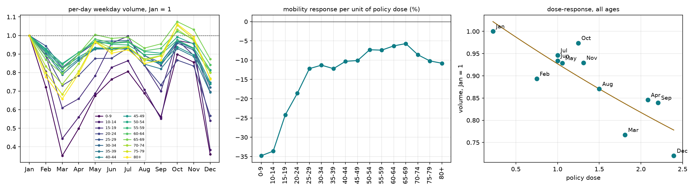

# Phase 10 — 劑量響應:年齡梯度與政策效力衰減

*狀態:**主張已被 11 個月推翻** · 見 [Phase 12](phase12-cases.md)*

> **11 個月更新:本頁 10.3 的「效力衰減」不成立。** 十二月的劑量最高、本地疫情最大,移動量卻是全年最低(0.720,深於三月的 0.767),殘差回到線下。殘差追的是疫情規模而非時間,而劑量/風險/時間在這份資料上不可分離。本頁的 10.1 水準表與 10.2 彈性仍然有效(數值已用 11 個月重算,見 `results_p10.json`)。

平日、無公休格子、星期組成已平衡、每日量、首爾內部。八個月構成七級劑量階梯。

---

## 10.1 各月的水準(一月 = 1)

| 年齡 | Jan | Feb | Mar | Apr | May | Jul | Aug | Sep |
|---|---|---|---|---|---|---|---|---|
| 0–9 | 1.000 | 0.722 | **0.351** | 0.499 | 0.675 | 0.806 | 0.688 | 0.561 |
| 10–14 | 1.000 | 0.806 | **0.443** | 0.560 | 0.687 | 0.864 | 0.708 | 0.551 |
| 15–19 | 1.000 | 0.890 | 0.609 | 0.659 | 0.783 | 0.996 | 0.840 | 0.699 |
| 20–24 | 1.000 | 0.895 | 0.730 | 0.784 | 0.876 | 0.933 | 0.839 | 0.732 |
| 25–29 | 1.000 | 0.944 | 0.827 | 0.899 | 0.960 | 0.968 | 0.893 | 0.839 |
| 30–34 | 1.000 | 0.927 | 0.820 | 0.900 | 0.970 | 0.973 | 0.891 | 0.855 |
| 35–39 | 1.000 | 0.907 | 0.789 | 0.865 | 0.927 | 0.927 | 0.846 | 0.820 |
| 40–44 | 1.000 | 0.916 | 0.803 | 0.873 | 0.930 | 0.939 | 0.870 | 0.854 |
| 45–49 | 1.000 | 0.924 | 0.821 | 0.883 | 0.934 | 0.932 | 0.870 | 0.849 |
| 50–54 | 1.000 | 0.928 | 0.849 | 0.909 | 0.966 | 0.964 | 0.914 | 0.904 |
| 55–59 | 1.000 | 0.914 | 0.843 | 0.909 | 0.970 | 0.949 | 0.897 | 0.897 |
| 60–64 | 1.000 | 0.891 | 0.822 | 0.898 | 0.981 | 0.966 | 0.917 | 0.930 |
| 65–69 | 1.000 | 0.869 | 0.795 | 0.901 | **1.005** | 0.990 | 0.932 | 0.955 |
| 70–74 | 1.000 | 0.834 | 0.737 | 0.848 | 0.970 | 0.939 | 0.873 | 0.891 |
| 75–79 | 1.000 | 0.800 | 0.682 | 0.807 | 0.966 | 0.938 | 0.865 | 0.890 |
| 80+ | 1.000 | 0.777 | **0.658** | 0.793 | 0.964 | 0.923 | 0.849 | 0.867 |
| **全齡** | **1.000** | **0.893** | **0.767** | **0.846** | **0.929** | **0.946** | **0.871** | **0.839** |

**三月是全年谷底(0.767),不是九月。** 兩個月的樣本完全看不到這件事 —— 這是補下載最直接的回報。

---

## 10.2 劑量彈性隨年齡呈 U 型,最低點在 65–69 歲

以 $\log(\text{量})$ 對劑量做 OLS,每個年齡層一條:

| 年齡 | 每單位劑量的變化 | r | | 年齡 | 每單位劑量的變化 | r |
|---|---|---|---|---|---|---|
| 0–9 | **−30.9%** | −0.80 | | 45–49 | −7.7% | −0.88 |
| 10–14 | −28.8% | −0.88 | | 50–54 | −5.5% | −0.78 |
| 15–19 | −20.4% | −0.85 | | 55–59 | −5.5% | −0.74 |
| 20–24 | −14.3% | −0.94 | | 60–64 | −5.0% | −0.56 |
| 25–29 | −8.3% | −0.88 | | **65–69** | **−4.6%** | **−0.40** |
| 30–34 | −7.8% | −0.82 | | 70–74 | −7.5% | −0.56 |
| 35–39 | −9.3% | −0.87 | | 75–79 | −9.0% | −0.52 |
| 40–44 | −8.0% | −0.85 | | 80+ | **−9.9%** | −0.53 |

三件事:

1. **U 型,不是單調。** 敏感度從 0–9 歲的 −30.9% 單調降到 65–69 歲的 −4.6%,然後**回升**到 80+ 的 −9.9%。兩個月的樣本只看得到下降那一段。
2. **最高齡的敏感度回到壯年水準。** 80+(−9.9%)和 35–39(−9.3%)幾乎一樣。這與「高風險族群減量最少」的簡單敘事相反 —— 那個敘事只在 60–69 歲成立。
3. **老年組的 $r$ 明顯較低(−0.40 至 −0.56)。** 60 歲以上的移動量與政策強度的關聯鬆散,他們的變動有很大一部分不是政策解釋的。對照 20–24 歲的 −0.94。

⚠️ 0–19 歲三層的數字**不能讀成防疫政策響應** —— [Phase 8](phase8-panel.md) 的安慰劑顯示它們主要是學制。它們的 −20% 到 −31% 是「教育政策 + 防疫政策」的合成。

---

## 10.3 同樣的管制強度,愈到後面買到愈少的減量

把全齡曲線對劑量配一條線,看各月偏離:

| 月 | 劑量 | 觀測 | 配適 | 殘差 |
|---|---|---|---|---|
| Jan | 0.22 | 1.000 | 0.985 | **+1.5%** |
| Feb | 0.75 | 0.893 | 0.935 | **−4.5%** |
| **Mar** | 1.81 | 0.767 | 0.843 | **−9.0%** |
| Apr | 2.08 | 0.846 | 0.821 | +3.1% |
| May | 1.06 | 0.929 | 0.908 | +2.3% |
| Jul | 1.00 | 0.946 | 0.913 | +3.6% |
| Aug | 1.50 | 0.871 | 0.869 | +0.2% |
| Sep | 2.21 | 0.839 | 0.811 | +3.5% |

**二月與三月坐在線下方(−4.5%、−9.0%),四月之後全部坐在線上方(+0.2% 到 +3.6%)。**

兩種讀法,兩個數字:

- **未經劑量調整**:三月的實際減量 23.3%,九月只有 16.1% —— 相差 7.2 個百分點,**而九月的劑量還更高**(2.21 vs 1.81)。
- **經劑量調整**(對配適線的殘差差距):**12.5%**。

無論哪種讀法,方向都一樣:**同一個形式上的管制強度,愈到後面買到愈少的減量。**

### 三個候選解釋(這份資料還分不開)

1. **自發恐懼響應。** 二三月是大邱新天地事件,單日確診破 900,全國恐慌。當時的減量大部分不是被規定出來的,是自己躲起來。九月的第二波規模小得多(單日高峰約 400),恐懼較低。
2. **行為適應 / 防疫疲勞。** 半年之後,同樣的規則被遵守的程度下降。
3. **政策內容不同。** 三月的「강화된 사회적 거리두기」與九月的「수도권 2단계」在文字上管的東西不一樣,我的劑量編碼把它們放在同一把尺上,可能編錯。

**(3) 可以用 `dose_alt` 的替代編碼檢驗;(1) 與 (2) 需要每日確診數才能分開 —— 這正是 [Phase 7](phase7-cases.md) 要拿的資料。**

> 這個「效力衰減」是目前手上最強的單一發現,而且它把 [Phase 7](phase7-cases.md)(病例端資料)從「錯位分析的前置作業」升級成「主結果的必要成分」。

---

## 10.4 五月與七月的谷底回升告訴我們什麼

65–69 歲在**五月回到 1.005** —— 完全回到一月水準,而全齡只回到 0.929。最高齡組(80+)也回到 0.964。

所以年長組不是「一直不動」,而是**跌得深、也回得快**:80+ 三月 0.658(比全齡的 0.767 更深),五月 0.964(比全齡的 0.929 更高)。他們的移動彈性大,但與政策強度的對應鬆散(r ≈ −0.53)。

這個「深跌快回」的模式與「高風險族群持續謹慎」的預期不符,值得單獨寫一節。
