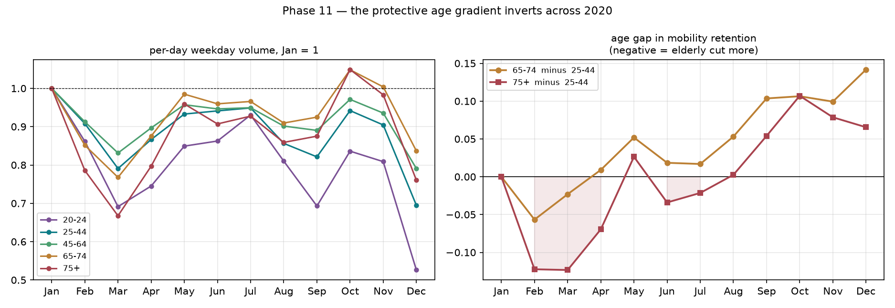

# Phase 11 — 保護性年齡梯度在 2020 年間反轉

*狀態:完成,並在 11 個月上加強 · **這是全部工作裡唯一不依賴模型設定的主結果***

> **11 個月更新:反轉持續到年底,而且在本地風險最高時依然成立。** 十月 65–74(1.048)與 75+(1.049)雙雙超過一月水準;十二月管制更嚴、首爾疫情是三月的 27.7 倍,75+ 仍比三月高 14.3%、20–24 歲低 22.4%。逐月 gap 與三月/十二月對比見 [Phase 12](phase12-cases.md) 12.3–12.4。

平日、無公休格子、星期組成已平衡、每日量、首爾內部。

---

## 11.1 各年齡群的水準(一月 = 1)

| | 20–24 | 25–44 | 45–64 | 65–74 | 75+ | gap 65–74 | gap 75+ |
|---|---|---|---|---|---|---|---|
| Feb | 0.862 | 0.908 | 0.913 | 0.851 | 0.786 | **−0.057** | **−0.122** |
| Mar | 0.691 | 0.791 | 0.831 | 0.768 | **0.668** | −0.023 | **−0.123** |
| Apr | 0.745 | 0.866 | 0.897 | 0.875 | 0.797 | +0.009 | −0.070 |
| May | 0.849 | 0.933 | 0.957 | 0.985 | 0.959 | +0.052 | +0.026 |
| Jul | 0.930 | 0.949 | 0.949 | 0.966 | 0.927 | +0.017 | −0.021 |
| Aug | 0.810 | 0.856 | 0.902 | 0.909 | 0.859 | +0.053 | +0.003 |
| Sep | 0.693 | 0.821 | 0.890 | 0.925 | 0.875 | **+0.104** | **+0.054** |

gap 為負 = 高齡減得比壯年多。**二、三月為負,五月之後轉正,九月達到最大。**

## 11.2 不依賴基線的陳述

上表的 gap 依賴「一月 = 1」這個基準。直接比較三月與九月則完全不需要基線 —— **而且九月的政策劑量更高(2.21 vs 1.81)**:

| 年齡 | 三月(人/日) | 九月(人/日) | Sep / Mar |
|---|---|---|---|
| 20–24 | 517,668 | 518,904 | 1.002 |
| 25–44 | 3,539,813 | 3,676,059 | **1.038** |
| 45–64 | 4,716,412 | 5,051,175 | 1.071 |
| 65–74 | 1,166,076 | 1,404,661 | **1.205** |
| 75+ | 623,485 | 817,506 | **1.311** |

> **在一個更嚴格的管制之下,75 歲以上的移動量比三月回升了 31.1%,壯年只回升 3.8%。**

## 11.3 空間穩健性:25 個區全部同號

以 (九月/三月 的 65+) 減 (九月/三月 的 25–44) 為超額回升:

| 最小的四個區 | 超額 | | 最大的四個區 | 超額 |
|---|---|---|---|---|
| 광진구 | +0.145 | | 관악구 | +0.230 |
| 성동구 | +0.151 | | 서대문구 | +0.233 |
| 강서구 | +0.167 | | 송파구 | +0.235 |
| 성북구 | +0.167 | | 용산구 | +0.235 |

**25 個區全部為正**,全距 +0.145 至 +0.235。不是少數地區帶動的。

## 11.4 為什麼這重要

1. **它是 [Phase 10](phase10-response.md) 效力衰減的機制。** 總體上「同一形式強度,三月比九月多買到 12.5% 的減量」;分解之後,衰減幾乎全部落在高齡端。
2. **它落在死亡率最高的族群。** 翻轉幅度隨年齡遞增(65–74 的 gap 擺動 16.1 個百分點,75+ 擺動 17.6 個)。
3. **它推翻了兩個月樣本得到的敘事。** 用 Jan vs Sep 兩點會得到「高齡減量最少」,那其實是**九月特有的現象**,而非全期特性 —— 二三月完全相反。

## 11.5 最大風險

**A1(市占選擇性)精準地打在這個結論上。** [Phase 9](phase9-coverage.md):KT 對 80+ 的覆蓋率是每 9.4 人觀測到 1 人(壯年 3.2),而 [Phase 8](phase8-panel.md) 顯示擴大權重跨八個月**完全凍結**,吸收不了任何攜帶率變化。

若疫情期間長輩的手機攜帶行為改變(例如第一波時減少外出且不帶機、之後恢復),9.4 倍的放大會把小的行為改變放成大偏誤,而且**方向恰好會製造出觀察到的反轉**。

**在 [Phase 3](phase3-calibration.md) 的外部校準完成之前,這個發現只能當作待驗證的現象,不能當作結論。** 這是全部工作裡最該優先解決的一件事。

## 11.6 分不開的兩個解釋

即使校準通過,還有兩個競爭解釋需要每日確診數才能分開:

- **自發恐懼消退** —— 二三月大邱新天地、單日破 900,高齡的恐懼反應最強;九月第二波規模小得多(高峰約 400)。
- **遵從度下降** —— 半年後同樣的規則被遵守的程度下降,而高齡族群的社交需求累積最久。

兩者的政策意涵完全不同:前者是「風險溝通失效」,後者是「管制工具失效」。→ [Phase 7](phase7-cases.md)
