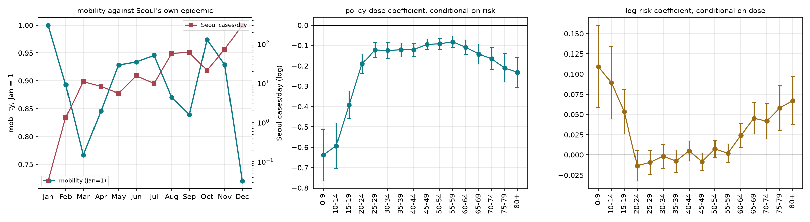

# Phase 12 — 政策強度 vs 感知風險:一個識別失敗的示範

*資料:11 個月移動資料 + KDCA 逐日確診(見 [phase7-cases.md](phase7-cases.md))*
*狀態:完成 · **推翻了 8 個月版本的「效力衰減」敘事** · 產出決策 D15*

---

## 12.0 十二月推翻了八個月的結論

八個月(缺 10–12 月)時,對劑量配線後的殘差看起來像單調衰減:二三月在線下,之後全在線上。**十二月把這個敘事推翻了。**

| 月 | 劑量 | 首爾確診/日 | 全國確診/日 | 移動量(Jan=1) | 對劑量線的殘差 |
|---|---|---|---|---|---|
| Jan | 0.23 | 0.0 | 0.3 | 1.000 | −2.0% |
| Feb | 0.75 | 1.3 | 35.2 | 0.893 | **−6.5%** |
| **Mar** | 1.81 | **10.9** | **272.3** | **0.767** | **−8.4%** |
| Apr | 2.08 | 8.2 | 43.8 | 0.846 | +4.6% |
| May | 1.06 | 5.5 | 17.4 | 0.929 | +1.0% |
| Jul | 1.00 | 9.8 | 49.8 | 0.946 | +2.1% |
| Aug | 1.50 | 57.1 | 140.0 | 0.871 | +0.1% |
| Sep | 2.21 | 60.4 | 163.3 | 0.839 | +5.4% |
| **Oct** | 1.25 | 21.4 | 81.7 | **0.974** | **+8.5%** |
| Nov | 1.31 | 72.9 | 200.6 | 0.929 | +4.3% |
| **Dec** | **2.39** | **301.9** | **793.5** | **0.720** | **−7.4%** |

**十二月是全年谷底(0.720),比三月(0.767)更深**,而且十二月同時是劑量最高、首爾本地疫情最大的月份。殘差在十二月又掉回線下 —— 所以它追的不是時間,**時間單調衰減的說法不成立**。

⚠️ 這直接作廢了 [PROPOSAL.md](../../PROPOSAL.md) 與舊版 [TOPICS.md](../../TOPICS.md) 的主軸。**補到 12 月是必要的,不是加分。**

---

## 12.1 二三月的首爾在替別人的疫情停下來

三月首爾自己每日只有 **10.9** 例,全國卻有 **272.3** 例 —— 疫情在大邱。首爾在自身風險幾近於零時把移動砍到 0.767。

十二月首爾自己每日 **301.9** 例(三月的 27.7 倍),移動是 0.720。

所以「本地風險」和「感知風險」在 2020 年的首爾是兩回事:上半年由**全國/大邱衝擊**驅動,下半年才由**本地疫情**驅動。任何用本地確診數當風險代理的模型,在上半年會嚴重低估風險。

---

## 12.2 規格檢定:任何結論都做得出來

把每個 (월, 요일) 乾淨平日格子當觀測(n = 44),對數移動量迴歸在劑量、log(1+首爾風險)、log(1+全國風險)、月份趨勢上。風險用**該格每個日期前 7 天**的平均確診數(出門當下讀得到的資訊)。

**75 歲以上:**

| 規格 | R² | 劑量 | 首爾風險 | 全國風險 | 月趨勢 |
|---|---|---|---|---|---|
| 只有劑量 | 0.213 | −0.108 (0.032) | | | |
| + 首爾風險 | 0.445 | −0.230 (0.040) | **+0.065 (0.016)** | | |
| + 全國風險 | 0.225 | −0.077 (0.051) | | −0.017 (0.021) | |
| + 兩個風險 | 0.721 | −0.144 (0.032) | **+0.122 (0.014)** | −0.105 (0.017) | |
| + 月趨勢 | 0.644 | −0.190 (0.025) | | | +0.029 (0.004) |
| + 首爾風險 + 月趨勢 | 0.785 | **−0.043 (0.035)** | **−0.144 (0.028)** | | +0.073 (0.009) |

**看最後兩列:首爾風險的係數從 +0.122 翻到 −0.144,只因為加了一個月趨勢。同時劑量係數從 −0.230 掉到 −0.043,變成和零分不開。**

全年齡也一樣(首爾風險 +0.038 → −0.088,劑量 −0.157 → −0.065)。

### 這不是行為結果,是識別結果

劑量、本地風險、經過時間在 2020 年的首爾**高度共線**:管制隨疫情加碼,疫情隨時間增長,而行為的恢復也隨時間。11 個月 × 5 個平日 = 44 個格子撐不起把三者分開。

> **D15:在這份資料上,「政策效果」與「風險反應」不可分離。** 任何報告單一係數的規格都是在報告規格選擇,不是在報告行為。
>
> 論文若要主張因果,必須要嘛(a)找到與時間不共線的劑量變異(月內跨星期只剩 4.67% 的變異,功效不足),要嘛(b)只報告不依賴迴歸的對比(見 12.3)。

---

## 12.3 唯一不依賴規格的結果:三月 vs 十二月

兩個月份直接比,不用迴歸、不用基線、不用劑量編碼:

| | 三月 | 十二月 | Dec / Mar |
|---|---|---|---|
| 政策劑量 | 1.81 | 2.39 | **更嚴** |
| 首爾確診/日 | 10.9 | 301.9 | **27.7 倍** |
| 20–24 歲移動 | — | — | **0.776** |
| 25–44 歲 | — | — | 0.882 |
| 45–64 歲 | — | — | 0.955 |
| **65–74 歲** | — | — | **1.094** |
| **75+ 歲** | — | — | **1.143** |

> **在管制更嚴、本地疫情是三月 27.7 倍的十二月,75 歲以上的移動量比三月高 14.3%,而 20–24 歲低 22.4%。**

這句話不依賴任何模型設定。年齡梯度的反轉([Phase 11](phase11-agegap.md))在本地風險達到全年最高時依然成立,而且幅度沒有縮小。

---

## 12.4 十一個月的年齡梯度(反轉持續到年底)

相對 25–44 歲的差距,gap 為負 = 高齡減得比壯年多:

| | Feb | Mar | Apr | May | Jul | Aug | Sep | Oct | Nov | Dec |
|---|---|---|---|---|---|---|---|---|---|---|
| 65–74 | −0.057 | −0.023 | +0.009 | +0.052 | +0.017 | +0.053 | +0.104 | **+0.106** | +0.099 | **+0.142** |
| 75+ | **−0.122** | **−0.123** | −0.070 | +0.026 | −0.021 | +0.003 | +0.054 | **+0.107** | +0.079 | +0.065 |

**十月時 65–74 歲(1.048)與 75+(1.049)雙雙超過一月水準**,而 20–24 歲只有 0.836。

---

## 12.5 病例端資料的粒度(Phase 7 的答案)

| 來源 | 粒度 | 期間 | 有年齡? |
|---|---|---|---|
| KDCA 15127820「시도별 발생 / 사망」 | **서울 × 日**,確診 + 死亡 | 2020-01-20 ~ 2023-08-31 | ✗ |
| KDCA 同檔「연령별(10세단위)」 | **全國 × 日 × 9 個 10 歲組** | 同上 | ✓ 但無地區 |
| KDCA 同檔「연령별 사망」 | 全國 × **年** × 年齡組 | 2020–2023 | 不是日 |
| KDCA 同檔「시군구별」 | 시군구 × **累計**發生率/死亡率 | 累計快照 | 不是日 |
| 서울 OA-20461 | 서울市 × 日 | ~2023-05-31 | ✗ |
| 서울 OA-20470 | **자치구 × 日**,確診 + 死亡 | — | ✗ |
| 양천구 | 행정동 × 日 | — | 只有一個區 |

> **年齡 × 地區的交叉在任何公開釋出裡都不存在。** 這正是 ../../reference/EDA.md Phase 7 預設的降級情境,只是年齡那個投影是**全國**而非首爾。
>
> 可用的折衷:假設首爾的病例年齡組成 ≈ 全國,則首爾年齡別確診 ≈ 首爾總數 × 全國年齡佔比。這是一條**必須明講的假設**,而且 2020 年上半年不成立(疫情在大邱,年齡組成由大邱教會群聚主導 —— 二月 20–29 歲佔 29.2%)。

資料已存成 `cases/daily_panel.csv`,建置腳本 `eda/cases_build.py`,原始檔 `cases/kdca_20230831.xlsx`(공공누리 1유형)。
