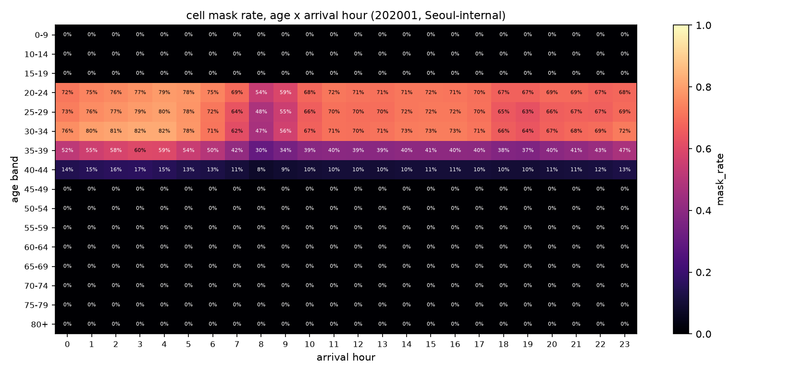
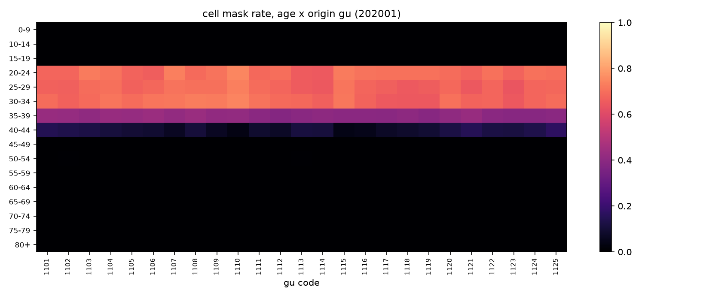
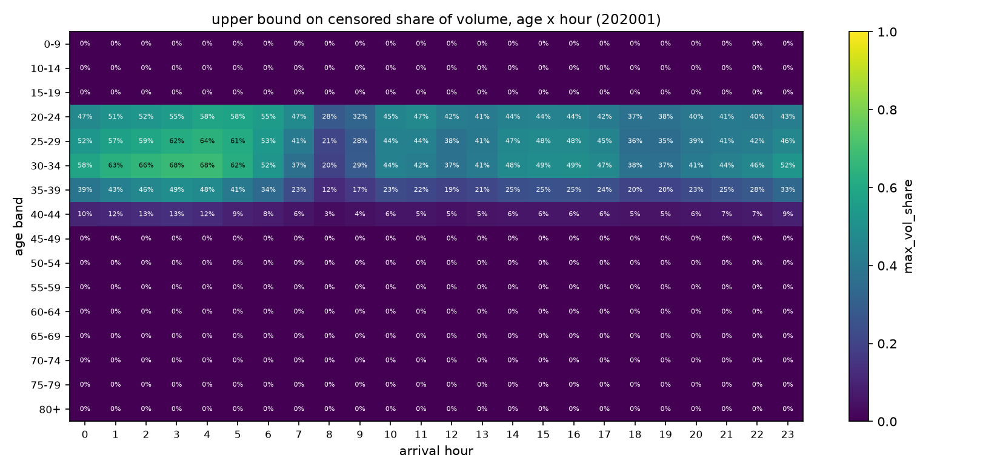

# Phase 2 — 遮蔽結構分析

> **8 個月更新:** 機制的定量部分已被 [Phase 9](phase9-coverage.md) 修正 —— 擴大權重是**格子層級**的、不是分層層級的常數,所以下面 2.2 用「最小發布值」當權重的讀法只是**下界**,不是典型值。定性結論(遮蔽只落在 20–44 歲、機制是門檻碰上隨年齡變的權重)不變。審查率跨 8 個月的穩定性見 [Phase 9](phase9-coverage.md) 9.4。

*狀態:完成 · 對應決策:年齡分箱 + 偏誤方向 · 產出決策 D4 / D5 / D6 / D7*

**結論:遮蔽結構跟 ../../reference/EDA.md 的預期完全相反 —— 而且相反的方向對這個題目是好消息。**

---

## 2.1 遮蔽是一條只存在於 20–44 歲的橫帶

格子遮蔽率(2020-01,首爾內部):

| 年齡 | 遮蔽率 | 年齡 | 遮蔽率 |
|---|---|---|---|
| 0–9 | **0.0%** | 45–49 | 0.0% |
| 10–14 | **0.0%** | 50–54 | 0.1% |
| 15–19 | **0.0%** | 55–59 | 0.0% |
| 20–24 | 69.7% | 60–64 | 0.0% |
| 25–29 | 67.6% | 65–69 | **0.0%** |
| 30–34 | 68.9% | 70–74 | **0.0%** |
| 35–39 | 40.6% | 75–79 | **0.0%** |
| 40–44 | 10.5% | 80+ | **0.0%** |

(以區為單位的中位數;20–34 歲在深夜可達 82%。)

**空間上均勻。** 同一年齡層在 25 個區之間的遮蔽率極集中 —— 25–29 歲:最小 0.637、中位 0.676、最大 0.734。沒有哪個區被差別對待,所以遮蔽不會製造空間上的選擇偏誤。

## 2.2 機制:遮蔽門檻碰上隨年齡變動的擴大權重

`*` 是對**擴大後**人口值套 `< 3` 的門檻,而每台裝置的擴大權重隨年齡(和性別)變。從各層最小發布值可以反推:

| 年齡 | 最小發布值 F / M | 最小的幾個值(F) | 讀法 |
|---|---|---|---|
| 0–9 | 6.05 / 6.05 | 6.05, 12.10, 12.11, 18.15, 18.16 | 一個裝置日 ≈ 6.05 人 → 永遠 ≥ 3,**不可能被遮蔽** |
| 10–14 | 4.88 / 5.37 | 4.88, 4.89, 4.99, 5.10 | 同上 |
| 15–19 | 3.32 / 3.68 | 3.32, 3.40, 3.51, 3.58 | 剛好過門檻 |
| 25–29 | 3.36 / 3.70 | 3.36, 3.44, 3.54, 3.56 | 該分層**至少有些格子**的權重 < 3 → 1–2 個裝置日被遮蔽 |
| 35–44 | 3.00 / 3.00 | 3.00, 3.01, 3.02, 3.03 | 權重恰好卡在門檻上 |
| 65–69 | 3.81 / 3.32 | 3.81, 3.82, 3.90, 4.03 | 回升 |
| 75–79 | 6.05 / 4.87 | 6.05, 7.20, 7.21, 7.37 | 粗權重 |
| 80+ | 6.05 / 6.05 | 6.05, 12.10, 15.81, 15.84 | **不可能被遮蔽** |

佐證:一月光是 40–44 歲就有 **1,055,771 格恰好等於 3.00** —— 該層有大量格子的權重正好卡在門檻上。

> ⚠️ 這張表的數字是各分層權重的**最小值**(即覆蓋最差的那些格子),不是典型值。典型值差很多:0–9 歲的最小值是 6.05,但格子層級的中位數是 **28.2**。完整的權重分布見 [Phase 9](phase9-coverage.md) 9.2。

> **KT 覆蓋率高的年齡層被審查,覆蓋率低的年齡層反而全部公開。**
>
> 代價換了方向,沒有消失:高齡資料完整但每一筆是「一台裝置放大六倍」,精度低、量化粗(80+ 的最小可分辨增量是 6.05 人);青壯年資料每筆支撐好,但格子少了一半以上。

## 2.3 對三個原定決策的答覆

### 70+/75+ 要不要併箱?(D5)

**為了遮蔽而併箱沒有必要** —— 65+ 全部年齡層的遮蔽率是 0。

若要併箱,理由應該是**擴大權重造成的量化噪音**,不是審查。80+ 的量化階距 6.05 人意味著一個 OD × 小時 × 性別 × 유형 格子的最小非零值就是 6 人,細粒度分析的訊噪比很差。建議:洞級分析時把 75+ 併成一箱,區級分析時維持 5 歲距。

### 高齡 × 深夜是不是全是 `*`,錯位分析要不要降級?(D6)

**不用降級。**

65+ × 22–04 時、首爾內部:

| | 格子數 | **遮蔽格數** | 每日量 |
|---|---|---|---|
| 2020-01 | 530,203 | **0** | 818,301 |
| 2020-09 | 409,149 | **0** | 638,893 |

../../reference/EDA.md 標為設計關鍵的那一格是**完全觀測到的**。錯位分析的高齡端可以留在洞粒度。

### `*` 怎麼填?(D4)

維持原案(主分析當 [0,3) 區間審查,敏感度用 0 / 1.5 / 3),但要知道**它只對 20–44 歲有影響**。

而且它比預期不敏感得多 —— 三種填法之間,Phase 6 的分層形狀相關中位數只在 0.653 / 0.668 / 0.694 之間移動:

| 填補 | 最小 | p05 | 中位 | > 0.95 |
|---|---|---|---|---|
| 0 | −0.501 | −0.180 | 0.694 | 3.4% |
| 1.5 | −0.528 | −0.184 | 0.668 | 4.2% |
| 3 | −0.563 | −0.199 | 0.653 | 4.6% |

**填補選擇不是本研究的敏感參數**,可以從死路清單降級成腳註。

## 2.4 真正該擔心的兩個性質

### (i) 時間上不均 —— 深夜資訊最少

首爾內部,全年齡:

| 到達時 | 格子遮蔽率 1月 | 被審查量上界 1月 | 格子遮蔽率 9月 | 被審查量上界 9月 |
|---|---|---|---|---|
| 03 | 42.2% | **30.5%** | 43.8% | 32.8% |
| 02 | 41.9% | 29.9% | 44.8% | 33.6% |
| 00 | 39.1% | 26.1% | 42.0% | 29.7% |
| **08** | **19.0%** | **7.8%** | 17.8% | 7.3% |
| 12 | 22.6% | 10.7% | 23.6% | 11.8% |
| 18 | 25.1% | 12.5% | 25.8% | 13.4% |
| 23 | 35.7% | 22.2% | 38.4% | 25.8% |

深夜的量體本來就是這題的重點(宵禁類措施、營業限制),而深夜正是資訊最少的地方。

### (ii) 兩個月之間不對稱 —— 直接偏誤 Sep/Jan 比值

九月**每個小時**的遮蔽率都略高於一月(整體 16.2% vs 15.7%)。原因是九月量體較低、且多數星期的月內出現次數較少,兩者都把更多格子推到門檻以下。

**後果:只用未遮蔽值算 Sep/Jan 比值會系統性低估九月。** Phase 6 因此在每個比值上都附了 [下界, 上界],而 20–34 歲的區間寬達 0.9–1.1(見 [phase6-dose.md](phase6-dose.md) 6.5)。

### (D7)20–34 歲的粒度處置

在「年齡 × 小時」粒度上,20–34 歲的響應在最壞情況下不可識別(區間寬度比響應本身還大)。三個選項:

- (a) 主分析用 1.5 填補並附界 —— 現行做法;
- (b) **20–34 歲降到「年齡 × 三小時窗」粒度**,格子變大、遮蔽率下降 —— **建議**;
- (c) 承認 20–34 歲只能給區間。

選 (b),因為 2.3 已經證明填補選擇不影響形狀結論,寬區間主要是水準的問題,而加大時間窗直接降低遮蔽率。
