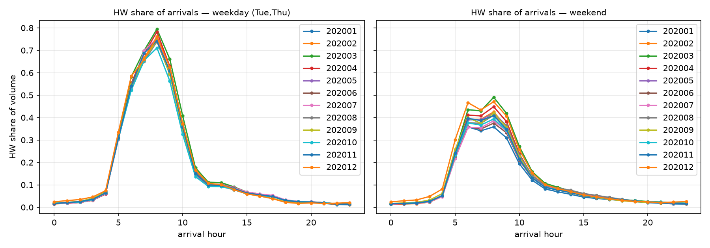

# Phase 4 — H/W/E 標籤的漂移診斷

*狀態:**已被 8 個月面板取代** · 對應決策:頭號地雷 WFH 內生性*

> **8 個月更新:結論從「找不到證據」升級為「通過」。** 決定性的新證據是 W 錨在七月完全回復到 1.003(分類器漂移不可逆),以及 HW 佔比在管制最嚴的三月達到最高點。見 [Phase 8](phase8-panel.md) 8.2。本頁的兩個月分析仍然有效,只是功效弱;下面「效力邊界」一節所要求的逐月序列已經拿到。

**結論:兩個月的對比找不到重分類的證據,三項診斷的方向都與假說相反 —— 但兩個相隔八個月的點,本來就是弱檢定。**

以下全部限定在**無假日的週二 + 週四**、首爾內部、每日量(見 [phase5-baseline.md](phase5-baseline.md) 的 D3)。

---

## 對立假設

疫情期「通勤流下降」部分是分類器把 WFH 者的日間常駐地改判成家。若成立,可觀測的簽名是:

- HW / WH(牽涉 W 錨)的量下降;
- HH / HE(H 錨內部)的量上升或至少持平;
- 被重分類的「假 HE」帶著通勤般的長旅行時間分布。

## (a) 型別間是移轉,還是整體萎縮?

首爾內部每日總量 **3,020 萬 → 2,513 萬(−16.8%)**。

| 유형 | Sep / Jan | 佔比變化 |
|---|---|---|
| **WH** 職→家 | **0.913** | +1.43 pp |
| **HW** 家→職 | **0.880** | +0.99 pp |
| HE | 0.854 | +0.44 pp |
| EH | 0.836 | +0.08 pp |
| HH | 0.825 | −0.02 pp |
| EW | 0.819 | −0.08 pp |
| WW | 0.805 | −0.12 pp |
| WE | 0.760 | −0.61 pp |
| **EE** 其他→其他 | **0.721** | **−2.10 pp** |

**通勤是所有型別裡最有韌性的,自由裁量移動掉最多。**

錨點層級的移轉檢定:

| 起點錨 | 2020-01 | 2020-09 | 比值 |
|---|---|---|---|
| E | 11,656,368 | 9,171,922 | 0.787 |
| W | 7,679,865 | 6,564,084 | 0.855 |
| H | 10,863,540 | 9,392,630 | **0.865** |

三個錨都在掉,H 錨掉得最少但只比 W 錨少 1 個百分點。**沒有出現「W 錨萎縮換 H 錨膨脹」的移轉特徵。** 重分類假說預測 HW/WH 下降、HH/HE 上升;實際是 HW/WH 下降**最少**、HH 比 WH 掉更多。方向相反。

## (b) 週末 HW 佔比當異常偵測器 —— 以及它為什麼會誤導

週末 HW **佔比**確實上升:

| | 2020-01 | 2020-09 | 相對變化 |
|---|---|---|---|
| 週六 HW 佔比 | 0.0874 | 0.1038 | +18.8% |
| 週日 HW 佔比 | 0.0737 | 0.0852 | +15.6% |

乍看像標籤問題(週末通勤理應極少且穩定)。但看**水準**就化解了:

- 週末 HW 的**量**只掉 5.7%(比值 0.943)
- 週末 EE 的量掉 37.3%(比值 0.627)

休閒移動崩掉之後,通勤的佔比是**機械性**上升的。

> **這一項給不出標籤漂移的證據,而且它示範了為什麼這個診斷必須看水準而非佔比。** 原案寫的是「週末的 HW 佔比當異常偵測器」—— 在一個總量大幅變動的期間,佔比是組成效應的函數,不能當異常偵測器用。改成「週末 HW 的每日量」才有辨識力。

## (c) 旅行時間分布

量加權平均旅行時間(分):

| 유형 | 1月 | 9月 | Δ |
|---|---|---|---|
| EE | 64.2 | 52.7 | **−11.5** |
| WE | 67.0 | 61.6 | −5.4 |
| WW | 56.5 | 50.5 | −6.0 |
| EW | 76.9 | 73.7 | −3.1 |
| HW | 56.1 | 53.9 | −2.2 |
| HE | 49.8 | 49.1 | −0.7 |
| EH | 51.3 | 51.2 | −0.1 |
| WH | 56.0 | 57.2 | +1.3 |
| HH | 35.3 | 39.4 | **+4.1** |

長程自由裁量行程整批消失(EE −11.5 分)。

**關鍵診斷:** 如果通勤者被改判成「假 HE」,早高峰(07–09)的 HE 應該染上通勤般的長旅行時間。

| 유형 | 月 | p25 | p50 | p75 | p90 |
|---|---|---|---|---|---|
| HE | 2020-01 | 22 | 39 | 61 | 87 |
| HE | 2020-09 | 23 | **40** | 62 | 90 |
| HW | 2020-01 | 30 | 47 | 67 | 92 |
| HW | 2020-09 | 30 | **46** | 66 | 90 |
| HH | 2020-01 | 9 | 21 | 46 | 80 |
| HH | 2020-09 | 10 | 25 | 53 | 87 |

HE 在該窗的分位數幾乎不動,且始終明顯短於 HW。**沒有污染跡象。**

(HH 的分布往右移了 4 分,是唯一有點動的。量體很小,先記著。)

## 效力邊界 —— 這一步沒有封掉地雷

型別標籤是在**一個月的觀測窗**上推定錨點的,漂移應該是漸進的。拿相隔八個月的**兩個點**去測漸進漂移,力量很弱。

上面三項只能說「2020-01 與 2020-09 之間沒有可見的重分類」,**不能排除 2 月到 8 月之間發生過又回復**,也不能排除兩個月都已經被同一個方向的偏誤污染(那樣比值會看起來正常)。

> **要真正封掉這個地雷,需要 2020 全年的逐月序列**,畫 HW 佔比與 HH/HE 佔比的軌跡,看轉折點是否對齊政策日期(對齊 = 行為;平滑漂移 = 標籤)。這是目前為止最值得再下載的資料。

## 對主分析的暫定建議

**不必完全繞開型別欄位。** 依據是 (a) 的錨點層級檢定和 (c) 的旅行時間穩定性。但:

- 主分析用**總量**,型別當分層而非主要對比;
- 任何以 HW 為主角的主張(如「通勤減量」)必須附上逐月軌跡;
- 型別分析一律用**每日量**而非佔比,理由見 (b)。
