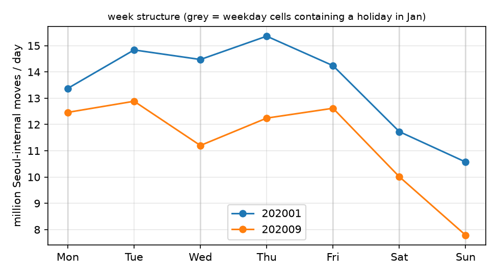
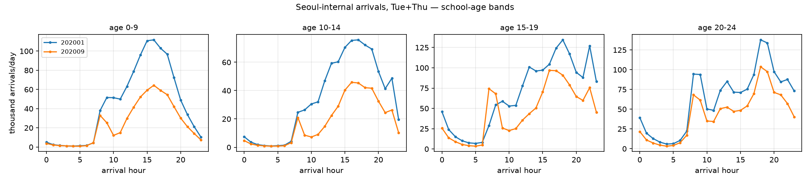

# Phase 5 — 基線效度與週結構

*狀態:原案已封閉,替代方案成立 · 對應決策:基線策略 · 產出決策 D3(已被 D3′ 取代)*

> **8 個月更新:D3 的「週二 + 週四」規則不再適用** —— 八個月裡沒有任何一個星期別在所有月份都無公休。改成格子層級排除(D3′)加星期組成再平衡(D11),見 [Phase 8](phase8-panel.md) 8.0。本頁其餘內容(假日污染的不可分離性、一月不是疫前基線、季節與學制混淆)全部不變,而且學制混淆已由 [Phase 8](phase8-panel.md) 8.5 的安慰劑量化。

**結論:原案不可執行(沒有日期欄位)。替代方案是「週二 + 週四」。但一月不是乾淨的疫前基線,而且無法修。**

---

## 5.1 原案為什麼不可執行

../../reference/EDA.md 寫的是:

> 2020-01 的**逐日**總量與年齡別日內曲線,標出農曆新年窗;確認 day-of-week 結構穩定後,定義 baseline = 1 月**非假日週**的星期別均值 [...] 若 1 月下旬已有自發反應——韓國首例 1/20 確診——基線窗要收到 1/19 前。

這需要日期。[Phase 0](phase0-contract.md) 確認資料只有 `대상연월 × 요일 × 도착시간`,**一月內部無法切**。三件事因此做不到:標出農曆新年窗、排除假日週、把窗收到 1/19 前。

## 5.2 假日污染是攤平掉的,只能推估不能移除

**2020-01 的公休:** 1/1(週三,신정)、1/24–27(週五、六、日、一,설 連假,1/27 是대체공휴일)。
**2020-09 的公休:** 9/30(週三,추석 前日)。추석 連假的 10/1–2 落在十月。

所以:

| 月 | 星期 | 月內次數 | 含假日天數 | 假日比例 | 每日量(首爾內部) |
|---|---|---|---|---|---|
| 2020-01 | 一 | 4 | 1 | 0.25 | 13,374,437 |
| 2020-01 | **二** | 4 | **0** | 0.00 | 14,837,908 |
| 2020-01 | 三 | 5 | 1 | 0.20 | 14,474,318 |
| 2020-01 | **四** | 5 | **0** | 0.00 | 15,361,865 |
| 2020-01 | 五 | 5 | 1 | 0.20 | 14,239,420 |
| 2020-01 | 六 | 4 | 1 | 0.25 | 11,727,864 |
| 2020-01 | 日 | 4 | 1 | 0.25 | 10,571,187 |
| 2020-09 | 一 | 4 | 0 | 0.00 | 12,461,632 |
| 2020-09 | **二** | 5 | **0** | 0.00 | 12,885,078 |
| 2020-09 | 三 | 5 | 1 | 0.20 | 11,201,399 |
| 2020-09 | **四** | 4 | **0** | 0.00 | 12,243,558 |
| 2020-09 | 五 | 4 | 0 | 0.00 | 12,618,249 |
| 2020-09 | 六 | 4 | 0 | 0.00 | 10,011,356 |
| 2020-09 | 日 | 4 | 0 | 0.00 | 7,785,935 |

用兩個月都乾淨的週二/週四當參照,反推假日壓抑幅度 δ(解 `observed = clean × (1 − 假日比例 × δ)`):

| | 假日比例 | 觀測值 | 乾淨參照 | 隱含 δ |
|---|---|---|---|---|
| 2020-01 週一 | 0.250 | 13,374,437 | 15,099,887 | 0.457 |
| 2020-01 週五 | 0.200 | 14,239,420 | 15,099,887 | 0.285 |
| 2020-09 週三 | 0.200 | 11,201,399 | 12,564,318 | 0.542 |

三個數彼此差很多,因為 **δ 和「週一/三/五本來就跟週二/四不同」這兩件事在月 × 星期的聚合下不可分離**。只能當量級參考(假日大約壓低三到五成),**不能當校正係數**。

## 5.3 決策 D3:跨月比較只用週二 + 週四

**週二與週四是兩個月裡唯二不含任何公休的星期別格子。**

這一個選擇同時解決三件事:

1. 假日污染(兩個月的這兩天都是零假日);
2. 星期別組成差異(不必再猜週一為什麼低);
3. 平日 vs 週末的行為混合(週二週四是典型平日)。

Phase 4 和 Phase 6 的全部主分析都限定在這兩天。週末另外單獨看(Phase 4b)。

> 代價:樣本從 7 個星期別降到 2 個,而且犧牲了週末的政策響應。往後有更多月份時,可以改成「以假日比例為共變量的星期別固定效果模型」,把七天都用上。現階段兩天已經夠乾淨。

## 5.4 一月仍然不是疫前基線,而且無法修

首例 1/20,**1/20–31 佔全月 38.7%**,且每個星期別格子都混了前後:

| 星期 | 月內日期 | 落在 1/20 之後 |
|---|---|---|
| 一 | 6, 13, 20, 27 | 2 / 4(50%) |
| 二 | 7, 14, 21, 28 | 2 / 4(50%) |
| 三 | 1, 8, 15, 22, 29 | 2 / 5(40%) |
| 四 | 2, 9, 16, 23, 30 | 2 / 5(40%) |
| 五 | 3, 10, 17, 24, 31 | 2 / 5(40%) |
| 六 | 4, 11, 18, 25 | 1 / 4(25%) |
| 日 | 5, 12, 19, 26 | 1 / 4(25%) |

連 D3 選出的週二、週四也各有 40–50% 的日子落在首例之後。

> **「基線窗收到 1/19 前」在這份檔案上做不到。** 如果一定要疫前基線,唯一的路是下載 **2019 年(或更早)** 的資料 —— 起始年月要到開放資料平台上確認 —— 而不是在 2020-01 內部想辦法。
>
> 折衷:把 2020-01 明確定義成「**早期基線**(early-pandemic baseline)」而非疫前基線,並在敏感度分析裡承認它已含約 40% 的自發反應期。這會讓所有 Sep/Jan 比值**低估**真實的政策效果。

## 5.5 兩個季節性混淆(不是資料問題,是設計問題)

### 學期

一月是寒假,九月是學期(且 8/26–9/20 首都圈全面遠距)。這直接吃掉 0–19 歲三個年齡層的可比性。

最明顯的證據在 [Phase 6](phase6-dose.md):15–19 歲在 07 時的 Sep/Jan 比值是 **2.7** —— 九月的早上學潮在一月完全不存在。這和政策無關。

### 季節

冬季 vs 初秋,日照、氣溫、通勤方式全都不同。單靠 Jan vs Sep 無法把季節從政策裡拆出來。這也是 [Phase 6](phase6-dose.md) 6.4 那個「早高峰前移一小時」的發現無法歸因的原因。

## 5.6 週形狀本身也在動(但這個比較被污染了)

以各月平均為 1 正規化:

| | 2020-01 | 2020-09 | 變化 |
|---|---|---|---|
| 一 | 0.990 | 1.101 | +0.112 |
| 二 | 1.098 | 1.139 | +0.041 |
| 三 | 1.071 | 0.990 | −0.081 |
| 四 | 1.137 | 1.082 | −0.055 |
| 五 | 1.054 | 1.115 | +0.061 |
| 六 | 0.868 | 0.885 | +0.017 |
| **日** | **0.782** | **0.688** | **−0.094** |

一月的週一、三、五、六、日和九月的週三都含假日,所以這張表不能直接當「週結構改變」的證據。

唯一還算能讀的是**週日**:一月的週日已經被 1/26(설 連假)壓低,九月的週日則沒有假日,**所以真實的週日下滑比表上的 −0.094 更大**。九月的週日是全部 14 個格子裡最低的(778 萬/日,只有九月週二的 60%)。這與「休閒移動被壓制最重」一致(見 [phase4-drift.md](phase4-drift.md) 的 EE 0.721),值得在有更多月份時正式估。
