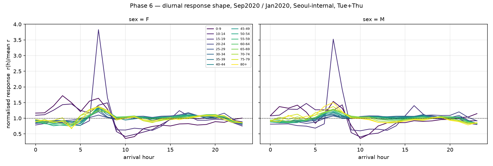
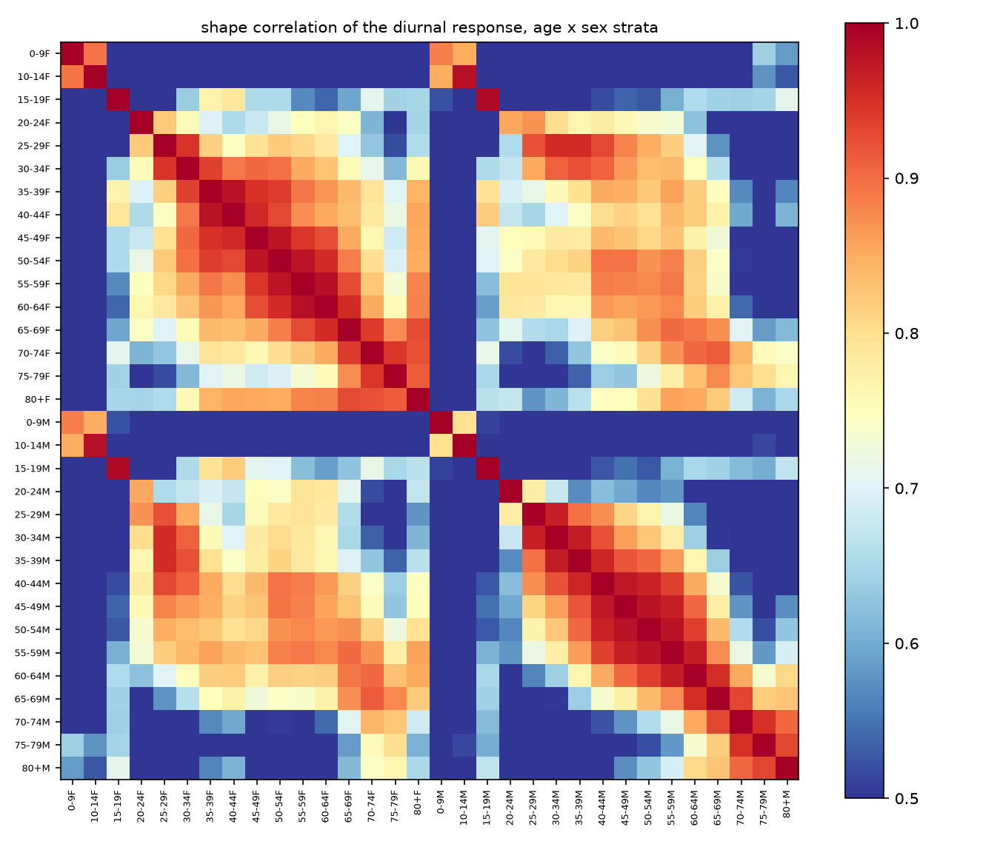
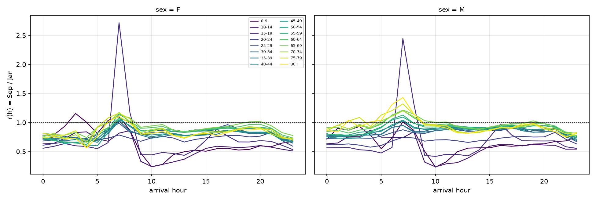

# Phase 6 — 劑量響應的第一眼

*狀態:**已被 8 個月面板判定** · 對應決策:核心命題可行性*

> **8 個月更新:go/no-go 已經有答案 —— 走「聚合遮蔽」線。** 本頁用兩個月得到的形狀異質性,在完整的七級劑量階梯上重複驗證成立,而且跨劑量的形狀也不穩定。見 [Phase 8](phase8-panel.md) 8.4。本頁 6.6「為什麼這不是 go/no-go」列的四個理由,前三個已由更多月份解除。

**結論:證據指向「聚合遮蔽」那一條線,而且很穩健。但兩個窗不構成劑量階梯,論文骨架的選擇還不能下。**

限定:週二 + 週四(見 [D3](phase5-baseline.md))、首爾內部、每日量、`*` 以 1.5 填補並附區間界。

---

## 6.1 全日水準響應 Sep / Jan

| 年齡 | F | M | | 年齡 | F | M |
|---|---|---|---|---|---|---|
| 0–9 | 0.522 | 0.571 | | 45–49 | 0.819 | 0.878 |
| 10–14 | 0.516 | 0.537 | | 50–54 | 0.880 | 0.932 |
| 15–19 | 0.673 | 0.681 | | 55–59 | 0.876 | 0.923 |
| 20–24 | 0.729 | 0.711 | | 60–64 | 0.902 | 0.960 |
| 25–29 | 0.835 | 0.833 | | **65–69** | **0.928** | **0.979** |
| 30–34 | 0.835 | 0.874 | | 70–74 | 0.853 | 0.924 |
| 35–39 | 0.798 | 0.849 | | 75–79 | 0.838 | 0.929 |
| 40–44 | 0.821 | 0.890 | | 80+ | 0.820 | 0.915 |

兩個清楚的梯度:

1. **年齡越大減量越少。** 25 歲以上單調上升到 65–69 歲的 0.93 / 0.98,之後才回落。高風險族群反而移動得最多 —— 這件事本身就值得寫。
2. **25 歲以上每一個年齡層,女性都比男性減得多**,差距 4–9 個百分點,且隨年齡擴大(65–69 歲差 5.1 pp,75–79 歲差 9.1 pp)。

## 6.2 形狀相關 —— 台北指標

把每個 年齡 × 性別 分層的 24 小時響應曲線 `r(h) = Sep(h)/Jan(h)` 各自除以自身均值,再兩兩算相關:

| 子集 | 對數 | 最小 | p05 | 中位 | > 0.95 | > 0.90 |
|---|---|---|---|---|---|---|
| 全部 16 個年齡層 | 496 | −0.528 | −0.184 | 0.668 | 4.2% | 10.7% |
| 去掉 0–14(學期混淆) | 378 | −0.011 | +0.332 | 0.755 | 5.3% | 13.8% |
| 25–64 歲 | 120 | +0.566 | +0.718 | 0.854 | 14.2% | 30.0% |
| 45+(低審查) | 120 | +0.330 | +0.455 | 0.826 | 8.3% | 22.5% |
| 45+,只看 06–22 時 | 120 | +0.744 | — | 0.884 | 20.8% | — |

**沒有任何一個子集接近 ../../reference/EDA.md 設的「全部 > 0.95 且跨層一致」門檻。**

三項穩健性:

- **對 `*` 填補不敏感** —— 填 0 / 1.5 / 3 三種,中位數只在 0.653 / 0.668 / 0.694 之間動。
- **不是被學齡層帶偏的** —— 去掉 0–14 之後中位數只從 0.668 升到 0.755。
- **不是被高審查層帶偏的** —— 只看 45+(遮蔽率 ≈ 0)仍然是 0.826。

各分層對**聚合曲線**的相關:中位 0.832,最小 0.066(0–9 歲男)、次小 0.146(0–9 歲女)、0.151(10–14 歲男)。**聚合曲線代表不了它的成分。**

## 6.3 差異出在哪裡(可直接寫進論文的表)

各時窗的 Sep/Jan 比值(F+M 合計):

| 年齡 | 早高峰 07–09 | 日間 11–15 | 晚高峰 17–19 | 夜間 21–23 | 深夜 00–04 |
|---|---|---|---|---|---|
| 0–9 | 0.668 | 0.496 | 0.572 | 0.653 | 0.832 |
| 10–14 | 0.594 | 0.430 | 0.594 | 0.557 | 0.675 |
| 15–19 | **1.185** | 0.529 | 0.709 | 0.606 | 0.567 |
| 20–24 | 0.696 | 0.666 | 0.741 | 0.675 | 0.553 |
| 25–29 | 0.820 | 0.843 | 0.848 | 0.721 | 0.654 |
| 30–34 | 0.843 | 0.853 | 0.862 | 0.741 | 0.723 |
| 35–39 | 0.844 | 0.807 | 0.838 | 0.740 | 0.725 |
| 40–44 | 0.907 | 0.843 | 0.870 | 0.792 | 0.767 |
| 45–49 | 0.919 | 0.841 | 0.866 | 0.772 | 0.725 |
| 50–54 | 0.982 | 0.897 | 0.917 | 0.823 | 0.765 |
| 55–59 | 0.977 | 0.877 | 0.915 | 0.828 | 0.752 |
| 60–64 | 1.023 | 0.898 | 0.947 | 0.850 | 0.808 |
| **65–69** | **1.065** | 0.904 | 0.981 | 0.868 | 0.853 |
| 70–74 | 1.009 | 0.833 | 0.909 | 0.797 | 0.823 |
| 75–79 | 1.015 | 0.824 | 0.903 | 0.803 | 0.827 |
| 80+ | 0.974 | 0.816 | 0.889 | 0.799 | 0.750 |

**年長組把減量集中在日間、晚間和深夜,早高峰反而增加;年輕組是全時段一起掉。** 這是形狀差異,不是水準差異 —— 正是「聚合遮蔽」線需要的東西。

深夜(00–04)是唯一在所有年齡層都被壓到 0.55–0.85 的窗,而且壓抑程度與年齡呈**反向**梯度(年輕人壓得更重)。

## 6.4 一個獨立的結構性發現:早高峰整體前移

首爾內部每日到達量(千人),週二 + 週四:

| 到達時 | 2020-01 | 2020-09 | 比值 |
|---|---|---|---|
| 05 | 227 | 192 | 0.846 |
| 06 | 413 | 406 | 0.983 |
| **07** | **775** | **873** | **1.127** |
| 08 | 1,996 | 1,857 | 0.930 |
| 09 | 1,922 | 1,576 | 0.820 |
| 10 | 1,481 | 1,209 | 0.816 |
| 11 | 1,616 | 1,358 | 0.840 |

**07 時的到達量在絕對值上增加了 13%,同時全日總量掉了 17%。**

排除了兩個假象解釋:

- 不是學齡層造成的 —— 只看 25 歲以上仍是 715 → 774(**1.082**);
- 不是型別組成造成的 —— 只看 25 歲以上的 HW(家→職)型仍是 472 → 517(**1.094**)。

尖峰往前挪了一小時。可能是 시차출퇴근(錯峰通勤)政策,也可能是季節性日照差異 —— **兩個月分不出來**,需要跨年同月比較(2019-09 vs 2020-09)。

## 6.5 審查區間有多寬 —— 這決定 20–34 歲能不能用

`r(h)` 的 [下界, 上界] 寬度:

| 年齡 | 最小 | 中位 | 最大 |
|---|---|---|---|
| 0–19 | 0 | 0 | 0 |
| 20–24 | 0.341 | **0.913** | 1.831 |
| 25–29 | 0.264 | **1.009** | 2.400 |
| 30–34 | 0.262 | **1.103** | 2.504 |
| 35–39 | 0.015 | 0.211 | 2.187 |
| 40–44 | 0.000 | 0.047 | 0.334 |
| 45+ | 0.000 | ~0.000 | 0.006 |

**在「年齡 × 小時」粒度上,20–34 歲的響應在最壞情況下不可識別** —— 區間寬度比響應本身(約 0.8)還大。

處置見 [phase2-masking.md](phase2-masking.md) 的 D7:把 20–34 歲降到「年齡 × 三小時窗」粒度。

## 6.6 為什麼這一步不是 go/no-go

../../reference/EDA.md 設想的是四個政策窗(基線 / 第一波 / 8–9月 2.5단계 / 12月)的劑量階梯,用跨劑量的形狀相關做判定。手上只有兩個點,而且每一個都有問題:

1. **九月不是單一劑量** —— 2.5단계(9/1–13)+ 2단계(9/14–30)的混合,月 × 星期聚合下無法拆開([Phase 0](phase0-contract.md));
2. **一月不是疫前** —— 38.7% 落在首例之後且不可移除([Phase 5](phase5-baseline.md));
3. **Jan vs Sep 同時混了季節與學期** —— 15–19 歲的 2.7 倍尖峰純粹是寒假 vs 學期;
4. **兩點無法定義「跨劑量」** —— 形狀相關需要至少三個劑量才能談單調性。

### 正確的說法

> **「聚合曲線代表不了分層」這個前提條件成立,而且對填補、對子集選擇、對審查程度都穩健。**
> **但「形狀是不是系統性質(跨劑量不變)」需要真正的劑量階梯才能判。**

兩條論文骨架之間的選擇還不能下。目前的證據**傾向**「聚合遮蔽」線,但那是拿一個兩點比較去回答一個關於跨劑量不變性的問題 —— 不夠。

**解鎖條件:2020 年 02–12 月的逐月資料。** 拿到之後這一步就變成真正的 go/no-go(見 [decisions.md](decisions.md) 的下一步)。
