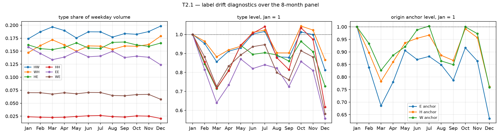
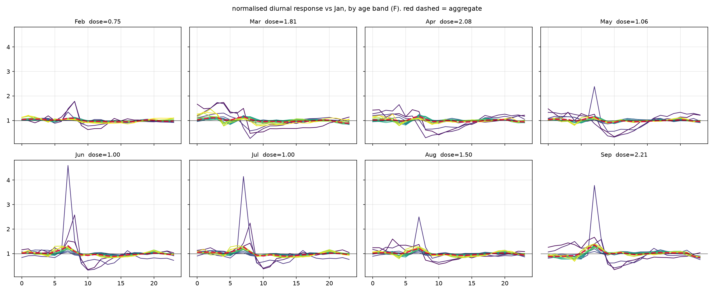

# Phase 8 — 8 個月面板:兩個月做不到的四件事

*資料:202001–202005、202007–202009(缺 6 月、10–12 月),930,074,533 列,逐檔對過 `wc -l`*
*狀態:完成 · 產出決策 D3′、D11 · 結案 P1、P2 的一部分*

---

## 8.0 D3 必須改寫:沒有一個星期別在所有月份都乾淨

八個月裡,**每一個星期別都至少有一個月含公休日**:

| | Mon | Tue | Wed | Thu | Fri | Sat | Sun |
|---|---|---|---|---|---|---|---|
| Jan | ✗ | ✓ | ✗ | ✓ | ✗ | ✗ | ✗ |
| Feb | ✓ | ✓ | ✓ | ✓ | ✓ | ✓ | ✓ |
| Mar | ✓ | ✓ | ✓ | ✓ | ✓ | ✓ | ✗ |
| Apr | ✓ | ✓ | ✗ | ✗ | ✓ | ✓ | ✓ |
| May | ✓ | ✗ | ✓ | ✓ | ✓ | ✓ | ✓ |
| Jul | ✓ | ✓ | ✓ | ✓ | ✓ | ✓ | ✓ |
| Aug | ✗ | ✓ | ✓ | ✓ | ✓ | ✗ | ✓ |
| Sep | ✓ | ✓ | ✗ | ✓ | ✓ | ✓ | ✓ |

**D3′:排除規則從「星期別層級」改成「格子層級」** —— 丟掉 56 格中含公休的 12 格,保留 44 格(79%)。一月只剩週二、週四,是最緊的月份。

代價是各月的星期別組成不同(一月只有二、四,二月有全部五天),而週一的量體本來就比週五低約 10%。所以再加一步:

**D11:以小時別的星期權重重新平衡。** 權重由**二月與七月**(唯二五個平日全乾淨的月份)估計:

| | Mon | Tue | Wed | Thu | Fri |
|---|---|---|---|---|---|
| 相對係數 | 0.935 | 1.002 | 1.012 | 1.012 | 1.039 |

之後所有跨月比較都是「平日、無公休、星期組成已平衡、每日量」。

---

## 8.1 T1.1 —— 擴大權重跨月完全凍結(識別假設 A1)

每個 年齡 × 性別 分層的最小發布值,八個月:

| | Jan | Feb | Mar | Apr | May | Jul | Aug | Sep | CV |
|---|---|---|---|---|---|---|---|---|---|
| 0-9 F/M | 6.05 | 6.05 | 6.05 | 6.05 | 6.05 | 6.05 | 6.05 | 6.05 | 0.000 |
| 10-14 F | 4.88 | 4.88 | 4.88 | 4.88 | 4.88 | 4.88 | 4.88 | 4.88 | 0.000 |
| 65-69 M | 3.32 | 3.32 | 3.32 | 3.32 | 3.32 | 3.32 | 3.32 | 3.32 | 0.000 |
| 80+ F/M | 6.05 | 6.05 | 6.05 | 6.05 | 6.05 | 6.05 | 6.05 | 6.05 | 0.000 |

32 個分層裡,**跨月變異係數的最大值是 0.012,中位數是 0.000**。權重連小數點後兩位都不動。

### 這件事對 A1 是好消息還是壞消息?

**兩者都是,而且方向很明確:**

- ✅ **好消息:權重不是逐月重新校準的。** 如果 KT 每月依最新人口推估重算 $\phi$,$\phi$ 本身就會隨時間變,A1 直接失效。它沒有。
- ⚠️ **壞消息:凍結的權重無法吸收任何覆蓋率變化。** A1 要的是偏誤 $\beta = \phi \cdot (K/N)$ 跨期不變。既然 $\phi$ 是常數,**A1 就完全等價於「KT 各年齡層的市占 × 手機攜帶率在 2020 年全年沒變」** —— 而疫情正是最可能改變攜帶率的事件。

**所以 T1.1 沒有支持 A1,它把 A1 的全部重量轉移到了 [Phase 3](phase3-calibration.md) 的外部校準上。** 這是一個更精確的陳述,不是一個較弱的擔憂。

---

## 8.2 T2.1 —— 標籤漂移(識別假設 A2):**通過**

平日、首爾內部、每日量,以一月為 1:

### 起點錨的水準

| | E 錨 | H 錨 | W 錨 |
|---|---|---|---|
| Jan | 1.000 | 1.000 | 1.000 |
| Feb | 0.838 | 0.897 | 0.933 |
| **Mar** | **0.686** | **0.783** | **0.826** |
| Apr | 0.780 | 0.860 | 0.887 |
| May | 0.906 | 0.936 | 0.921 |
| **Jul** | 0.882 | 0.967 | **1.003** |
| Aug | 0.849 | 0.886 | 0.864 |
| Sep | 0.787 | 0.866 | 0.849 |

**決定性證據:W 錨在七月完全回復到 1.003。**

分類器漂移是不可逆的 —— 一旦把 WFH 者的日間錨從 W 改判成 H,那個人不會在兩個月後自己變回去。觀察到的是 W 錨跌到 0.826(三月)再完全回到 1.003(七月),然後隨第二波再跌到 0.849。**這是行為軌跡,不是標籤軌跡。**

### 型別佔比

| | EE | HW | WH | HE | HH |
|---|---|---|---|---|---|
| Jan | 0.1579 | 0.1738 | 0.1473 | 0.1621 | 0.0238 |
| Feb | 0.1457 | 0.1873 | 0.1607 | 0.1549 | 0.0231 |
| **Mar** | **0.1337** | **0.1967** | **0.1719** | 0.1531 | 0.0226 |
| Apr | 0.1387 | 0.1897 | 0.1620 | 0.1574 | 0.0230 |
| May | 0.1493 | 0.1755 | 0.1501 | 0.1660 | 0.0244 |
| Jul | 0.1407 | 0.1871 | 0.1597 | 0.1553 | 0.0263 |
| Aug | 0.1499 | 0.1771 | 0.1536 | 0.1669 | 0.0241 |
| Sep | 0.1378 | 0.1838 | 0.1600 | 0.1676 | 0.0233 |

**HW 佔比在三月達到最高點(0.1967)** —— 也就是管制最嚴、WFH 最普及的那個月。重分類假說預測的方向恰好相反(WFH 高峰時 HW 應該被吃掉)。而且佔比是**上下起伏**的(0.174 → 0.197 → 0.176 → 0.187 → 0.177 → 0.184),不是單調漂移。

> **結論:A2 從「弱支持」升級為**通過**。** 兩個月時只能說「找不到證據」;八個月的軌跡有三個獨立特徵都與標籤漂移不相容:W 錨的完全回復、HW 佔比在管制高峰達到最大、以及佔比的非單調起伏。
>
> **決策 D9 可以放寬:型別欄位可以進主分析。** 但仍建議用每日量而非佔比(理由見 [Phase 4](phase4-drift.md) (b))。

---

## 8.3 劑量階梯

由 [calendar_kr.py](../calendar_kr.py) 的政策日曆算出,各月乾淨平日格子的平均劑量:

| 月 | 劑量 | 主要成分 |
|---|---|---|
| Jan | 0.23 | pre / 首例後 |
| Feb | 0.75 | 首例後 / 위기경보 심각 |
| Jul | 1.00 | 생활 속 거리두기 |
| May | 1.06 | 생활 속 / 사회적 거리두기 |
| Aug | 1.50 | 생활 속 / 수도권 2단계 |
| Mar | 1.81 | 위기경보 심각 / 강화된 거리두기 |
| Apr | 2.08 | 강화된 / 사회적 거리두기 |
| Sep | 2.21 | 수도권 2.5단계 / 2단계 |

⚠️ 劑量的數值是**建模選擇**,不是官方數字(2020-06-28 之前沒有三階段體系)。`calendar_kr.py` 同時提供 `dose_alt` 作為替代編碼,所有結論都應該用兩種編碼各跑一次。

---

## 8.4 P6 —— 形狀檢定的最終判定:**兩條腿都不成立**

以一月為基準,計算每個分層的日內響應曲線 $r(h)$,各自除以自身均值。

### (a) 跨分層(混合物假象檢定)—— 在**每一個**劑量上分別做

| 月 | 劑量 | 中位相關(全 16 層) | 中位(25+) | 中位(45+) | >0.95 比例(45+) |
|---|---|---|---|---|---|
| Feb | 0.75 | 0.565 | 0.701 | 0.733 | 1.7% |
| Jul | 1.00 | 0.685 | 0.803 | 0.862 | 6.7% |
| May | 1.06 | 0.386 | 0.507 | 0.630 | 0.8% |
| Aug | 1.50 | 0.563 | 0.706 | 0.824 | 5.8% |
| Mar | 1.81 | 0.519 | 0.616 | 0.690 | 3.3% |
| Apr | 2.08 | 0.363 | 0.540 | 0.550 | 2.5% |
| Sep | 2.21 | 0.646 | 0.794 | 0.824 | 10.0% |

**在七個劑量的每一個上,分層形狀都不一致。** 這不是 Jan/Sep 那一對的偶然。

### (b) 跨劑量(形狀是不是系統性質)—— 在**每一個**分層內分別做

| 年齡 | 中位(F) | 中位(M) | 最小(F) | >0.95 |
|---|---|---|---|---|
| 20-24 | 0.807 | 0.680 | −0.220 | ≈0 |
| 25-29 | 0.516 | 0.647 | −0.131 | 0 |
| 45-49 | 0.729 | 0.639 | 0.491 | 0 |
| 65-69 | 0.599 | 0.754 | 0.035 | ≈0 |
| 80+ | 0.660 | 0.772 | −0.065 | 0 |

**聚合曲線本身:跨劑量中位相關 0.824,最小 0.265,只有 9.5% 超過 0.95。**

### 判定

../../reference/EDA.md 的 go/no-go 寫的是:

> 如果分層形狀相關全部 >0.95 且跨層一致,混合物假象假設初步不成立,主張走「形狀是系統性質的跨城穩健化」;如果某些年齡層形狀明顯不同,走「聚合遮蔽」線。

**結果是走「聚合遮蔽」線,而且是在完整的七級劑量階梯上判定的,不是兩點外推。** 台北的結果在首爾不重現 —— 這件事本身就是論文的一個發現,不是題目的失敗。

---

## 8.5 PLB —— 五月 vs 七月:同劑量、不同季節的安慰劑

七月(劑量 1.00)與五月(劑量 1.06)幾乎同劑量,相隔兩個月、跨越春夏。任何差異都是季節、學制或行為適應,**不是政策**。

| 年齡 | Jul / May |
|---|---|
| 0-9 F / M | 1.190 / 1.197 |
| 10-14 F / M | 1.283 / 1.233 |
| 15-19 F / M | 1.296 / 1.251 |
| 20-24 F / M | 1.081 / 1.046 |
| **25+ 全部** | **0.956 – 1.021,中位 0.997** |

**25 歲以上通過得非常漂亮:同劑量、不同季節,移動量一致到 ±4% 以內。** 這是一個強力的安慰劑檢定,支持把跨月差異歸因於劑量。

**20 歲以下失敗(差 19–30%)。** 這是學制,不是防疫政策 —— 五月是分階段復課(고3 於 5/20,其餘 5/27 起錯開),七月是隔週到校。

> **決策:0–19 歲三個年齡層必須從主分析獨立出來**,當作「教育政策響應」而非「防疫政策響應」處理。它們也正是 [Phase 6](phase6-dose.md) 裡與聚合曲線相關度最低(0.07–0.19)的三層。

---

## 8.6 月內跨星期的劑量變異:能識別,但太小

政策切換日落在月中,所以同一個月裡不同星期別分到不同的劑量比例(例如九月的週一只有 25% 落在 2.5단계,週四是 50%)。加上月固定效果與星期固定效果之後,剩下的就是純由日曆決定的變異 —— 對行為而言是外生的。

| | sd | 範圍 |
|---|---|---|
| 原始劑量 | 0.598 | [0.20, 2.25] |
| 雙向固定效果後 | 0.129 | [−0.213, +0.198] |
| **存活的變異比例** | **4.67%** | |

**只有 4.67% 的劑量變異能撐過雙向固定效果。** 這個設計在原理上很漂亮(日曆外生),但功效太低,**只能當穩健性檢查,不能當主要識別策略**。要當主設計的話,需要更多有月中切換的月份 —— 2020 年 10–12 月(11/19 首都圈 1.5단계、11/24 2단계、12/8 2.5단계)正好切換密集,值得補下載。
